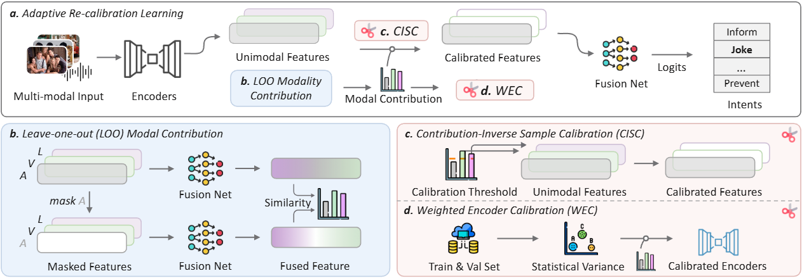

# Adaptive Re-calibration Learning for Balanced Multimodal Intention Recognition

[](https://neurips.cc/virtual/2025/loc/san-diego/poster/116409)

> **"Adaptive Re-calibration Learning for Balanced Multimodal Intention Recognition"**  
> Qu Yang, Xiyang Li, Fu Lin, Mang Ye [[Link]](https://neurips.cc/virtual/2025/loc/san-diego/poster/116409)

<div align="center">
  
</div>

## Overview

This repository provides the implementation of Adaptive Re-calibration Learning (ARL), a novel approach for balanced multimodal intention recognition. 

## Citation

If you find this work useful, please cite our paper:

```bibtex
@inproceedings{yang2025adaptive,
  title={Adaptive Re-calibration Learning for Balanced Multimodal Intention Recognition},
  author={Yang, Qu and Li, Xiyang and Lin, Fu and Ye, Mang},
  booktitle={Neural Information Processing Systems},
  year={2025}
}
```

## Acknowledgements

This codebase is built upon [MIntRec](https://github.com/thuiar/MIntRec). We thank the authors for their excellent work and open-source contribution.

## License

This project is licensed under the MIT License.

